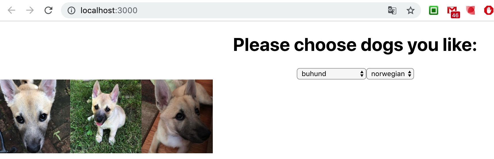
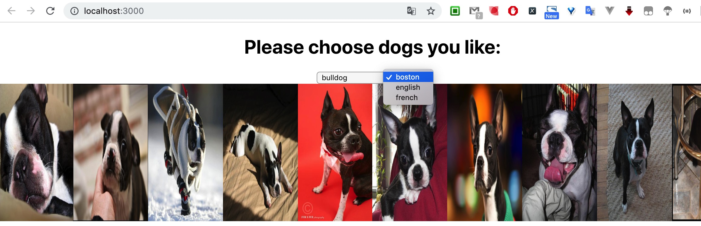

### Project description
An example project use typescript，node.js and react.js skills

### How to run
1. clone project to local
2. go to dog-ceo-projects folder
3. install dependencies
    ```
    npm install
    cd client
    npm install
    ```
4. go back to dog-ceo-projects folder, execute command to start
    ```
    npm run dev
    ```
* run server separately: npm run server
* run client separately: npm run client

### Function description
> List all breed and subbreed in given style

request:
```
http://localhost:5000/api/listAllBreedAndSubbreed
```
response:
```
[
  {
    "breed": "affenpinscher",
    "subbreed": ""
  },
  {
    "breed": "african",
    "subbreed": ""
  },
  {
    "breed": "airedale",
    "subbreed": ""
  },
  {
    "breed": "akita",
    "subbreed": ""
  },
  {
    "breed": "appenzeller",
    "subbreed": ""
  },
  {
    "breed": "basenji",
    "subbreed": ""
  },
  {
    "breed": "beagle",
    "subbreed": ""
  },
  {
    "breed": "bluetick",
    "subbreed": ""
  },
  {
    "breed": "borzoi",
    "subbreed": ""
  },
  {
    "breed": "bouvier",
    "subbreed": ""
  },
  {
    "breed": "boxer",
    "subbreed": ""
  },
  {
    "breed": "brabancon",
    "subbreed": ""
  },
  {
    "breed": "briard",
    "subbreed": ""
  },
  {
    "breed": "buhund",
    "subbreed": "norwegian"
  },
  {
    "breed": "bulldog",
    "subbreed": "boston,english,french"
  }
  ...
  ]
```

> List images with given breed name

request:
```
http://localhost:5000/api/getImgsByBreed/hound
```
response:
```
[
  "https://images.dog.ceo/breeds/hound-afghan/n02088094_1003.jpg",
  "https://images.dog.ceo/breeds/hound-afghan/n02088094_1007.jpg",
  "https://images.dog.ceo/breeds/hound-afghan/n02088094_1023.jpg",
  "https://images.dog.ceo/breeds/hound-afghan/n02088094_10263.jpg",
  "https://images.dog.ceo/breeds/hound-afghan/n02088094_10715.jpg",
  "https://images.dog.ceo/breeds/hound-afghan/n02088094_10822.jpg",
  "https://images.dog.ceo/breeds/hound-afghan/n02088094_10832.jpg",
  "https://images.dog.ceo/breeds/hound-afghan/n02088094_10982.jpg",
  "https://images.dog.ceo/breeds/hound-afghan/n02088094_11006.jpg",
  "https://images.dog.ceo/breeds/hound-afghan/n02088094_11172.jpg",
  "https://images.dog.ceo/breeds/hound-afghan/n02088094_11182.jpg",
  ...
]
```

> Sample screenshot




    
### TODO List
- [ ] Integration tests
- [ ] Provide ability to run this API in a Docker container
- [ ] Open the app, nothing should be selected by default
- [ ] Image should be displayed in responsive grid(page style to be adjust)
- [ ] When select breed, subbreed dropdown list should not selected by default
- [ ] Should display error and loading indicator for all ajax requests
- [ ] Deep link to a particular breed/subbreed
- [ ] Client site should use typescript
